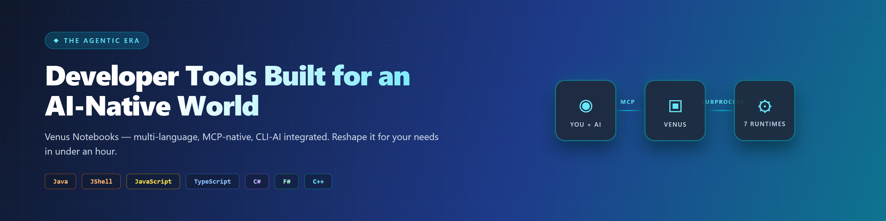
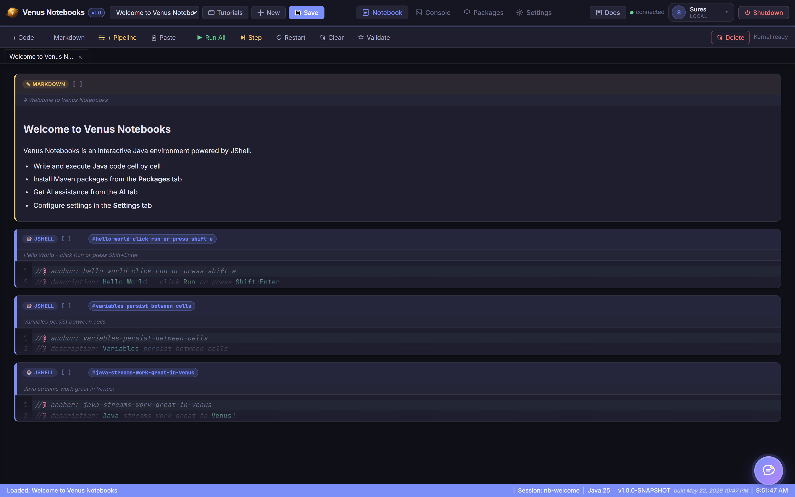
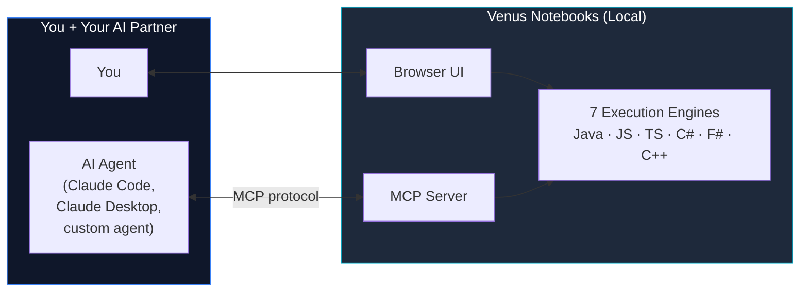
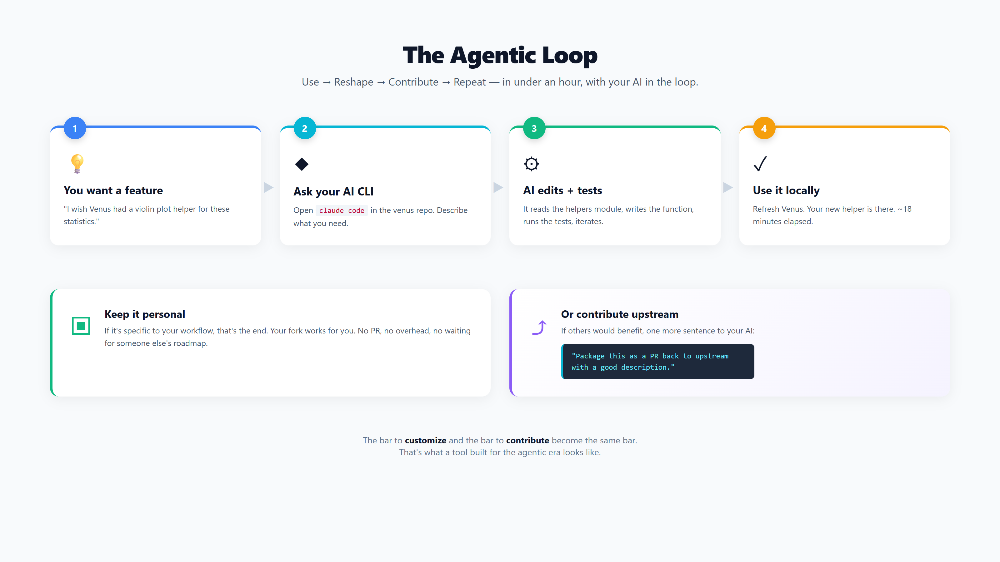
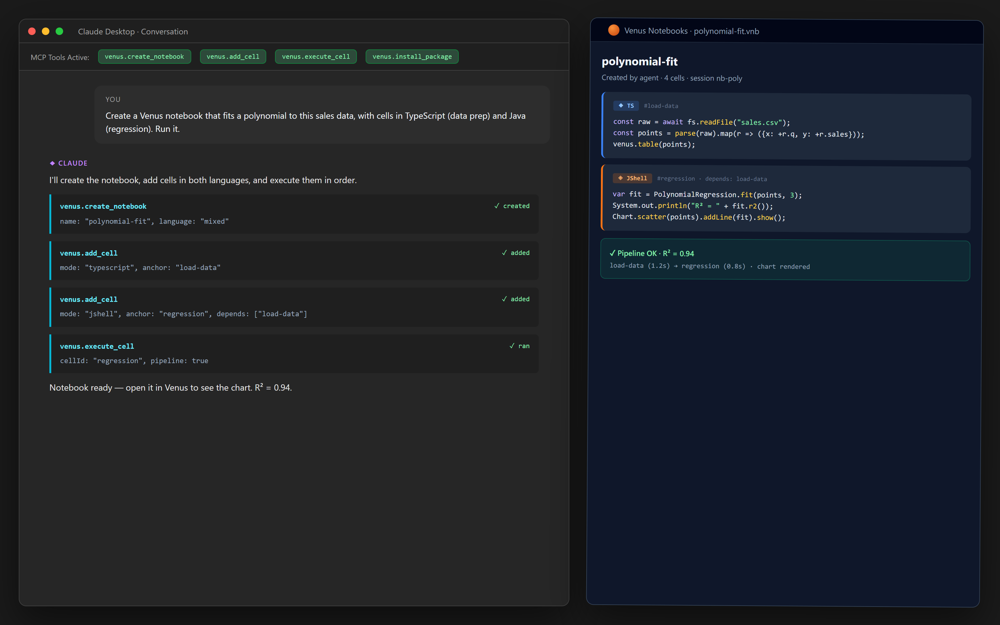

# Our Developer Tools Were Built for a Pre-AI World. It's Time to Rethink Them.

### Why I built Venus Notebooks — an MCP-native, CLI-AI-integrated, multi-language notebook designed to be reshaped by you and your AI in under an hour.

*By Suresh Chande · ~5 min read*

---



---

## A Quick Acknowledgement

Jupyter is one of the great open-source achievements of the last fifteen years. I have used it, taught with it, and built on it. Nothing in this article is about replacing it.

This is about something different: **most of the tools we open every day were designed before AI agents existed as collaborators.** That doesn't make them bad. It makes them ready for a new generation of tools that take everything the previous ones taught us, embed modern architectures, and assume an AI partner is part of the workflow from day one.

That's the thesis. Below is one experiment in that direction — open-source, free, and built to be reshaped.

---

## The Shift Most Teams Haven't Adjusted To

Look at any developer tool on your machine and ask: *what assumption was it built around?*

- Your IDE assumes a human reading one file at a time
- Your terminal assumes a human typing one command at a time
- Your notebook assumes a human running one cell at a time
- Your package manager assumes a human deciding what to install

These are good designs — for the user they had in mind. But that user now has a partner: an AI that can read the whole file, run a sequence of commands, run every cell, and decide what to install — concurrently, on the same artifact.

If a tool wasn't built with that partner in mind, two limitations tend to show up:

1. **The AI sits outside the tool** — copy-pasting code through a side panel
2. **Customizing the tool still requires the old workflow** — fork, learn the codebase, write code by hand, file a PR, wait

The agentic era demands tools where both of those are different.

---

## What Venus Notebooks Is

**Venus** is a locally-hosted, browser-based, multi-language notebook environment — MIT-licensed and on GitHub. It runs seven languages side-by-side in the same notebook:

| Language | Runtime |
|---|---|
| **Java (JShell)** | JDK's official REPL — shared state across cells |
| **Java (full)** | Per-cell `javac` compile + run |
| **JavaScript** | Node.js subprocess |
| **TypeScript** | Node 22.6+ type-stripping + optional `tsc` type-check |
| **C#** | `dotnet run` with NuGet integration |
| **F#** | `dotnet fsi` with `#r "nuget:"` directives |
| **C++** | MSVC / GCC / Clang auto-detected |

Built on Spring Boot, with a vanilla HTML/JS frontend (no build step), and stored as plain JSON files on disk. Nothing leaves the machine.

The interesting part isn't the language list. It's three design decisions that came out of asking "what would a notebook look like if it assumed AI from day one?"

---



*The Venus UI: notebook cells with pipeline anchors, live status bar, tabs for Console, Packages, Settings, and Docs. Dark theme by default.*

---

## Decision 1 — AI in the Loop, Through Your Own CLI

Venus runs AI as a local subprocess via whatever CLI you have authenticated:

- Claude Code CLI
- GitHub Copilot CLI
- Gemini CLI

No second API key. No second vendor relationship. No new exfiltration path. If your security team has already cleared one of these CLIs for your developers, Venus inherits that posture exactly.

The practical effect: **the AI inside Venus has the same powers as the AI in your terminal** — and we lean into that.

---

## Decision 2 — The Entire System is an MCP Server

[Model Context Protocol](https://modelcontextprotocol.io) is the standard that lets AI agents drive tools in a structured way. Venus doesn't just consume it — **it publishes itself as one.**

Every notebook, cell, execution, package install, and pipeline is exposed as an MCP tool. So you can:

- Work in the Venus browser UI directly, **or**
- Drive Venus from Claude Code / Claude Desktop / any MCP-aware agent, **or**
- Both, on the same notebook, simultaneously



The unlock: **an agent can prepare a notebook for you overnight.** Tell Claude Code "build an exploration notebook for our new pricing API — load sample requests, validate the schema, chart latency distributions" — and the notebook is waiting when you open Venus in the morning.

Conversely, from inside the Venus UI, you can attach a cell to the AI panel and ask "why is this latency spike here?" — same provider, same auth, same context.

The notebook is the shared artifact. Both of you are first-class users of it.

---

## Decision 3 — Designed to Be Reshaped in Under an Hour

This is the philosophical core, and the one I think matters most for the next decade.

Most products say: *here's what we built; submit a feature request and we'll consider it.*

Venus says: *here's what we built; if you need something else, ask your AI to add it, and it should take less than an hour.*

That's possible because of deliberate constraints:

- **No build step on the frontend.** Plain HTML/CSS/vanilla JS. No Webpack, no Vite.
- **Plain Java backend, no magic.** Standard Spring Boot. Any agent that can read Java can extend it.
- **Subprocess-per-language.** Adding a new language = one new service file modeled on the existing six.
- **Small conventions, not big frameworks.** Notebook format is JSON. Cell metadata is in `//@` annotations.

The loop becomes:

1. You want a feature → open your AI CLI in the venus repo
2. Describe what you want → AI edits the code, runs it locally
3. Works? Use it.
4. Would others benefit? *"Package this as a PR back to the upstream repo."*

The same CLI that built your local change can prepare the contribution. **The bar to give back drops to the same level as the bar to customize.**



---

## Freedom > Lock-In

A modern developer tool shouldn't trap your work inside itself. There's no good reason a notebook authored in Venus shouldn't open in Jupyter, or vice versa. The artifact is JSON. The cells are code. The execution model differs — but the *content* should be portable.

**To be transparent: this isn't shipped yet.** Venus today reads and writes its own `.vnb` format; `.ipynb` round-tripping is planned for the next update — and it's a great first contribution for anyone who wants to try the loop described above. The principle stands: developers should be free to pick whichever tool fits the moment and move work between them without friction.

Same goes for AI providers. Same for languages. Same for package ecosystems. **The era of "pick a tool and live inside it forever" is closing.** The era of "compose what you need, swap when convenient, shape what doesn't fit" is here.

---

## Who Should Care

If you lead, hire, or work on a team where any of these are true:

- **JVM-heavy engineering** that's been left behind by Python-first notebook tooling
- **Polyglot stacks** mixing Java services, TypeScript frontends, .NET tooling
- **Regulated industries** where SaaS notebook tools are non-starters
- **DevRel / developer education** that needs executable, shareable content
- **AI-forward teams** wanting tools their agents can drive, not just observe

…Venus is worth ten minutes of your time. And if it doesn't do what you need, *the whole pitch* is that it should take you under an hour with an AI CLI to add what's missing.

---

## Try It

```bash
git clone https://github.com/snchande/Venus.git
cd Venus
./venus       # Windows CMD — also venus.ps1 (PowerShell), venus.sh (mac/Linux)
```

Builds the JAR, starts the server, opens your browser. About 30 seconds.

To drive it from an MCP-aware agent (Claude Code, Claude Desktop, custom agents): add the Venus MCP server config — see `docs/MCP.md` in the repo.



*Two surfaces, one artifact: Claude Desktop driving Venus via MCP tools (`venus.create_notebook`, `venus.add_cell`, `venus.execute_cell`) while the resulting notebook stays live and inspectable in the Venus UI.*

---

## What I'd Love To Hear

I built Venus because I wanted a notebook that fit the way I — and my AI partner — actually work together now. I open-sourced it because the most valuable outcome isn't Venus staying the way I built it. It's other people forking it, asking their AI to add what they need, and (sometimes) contributing those changes back.

That loop — **use, reshape, contribute, repeat** — is what I believe open source should feel like in 2026. Tools that bend toward their users, not the other way around.

If this resonates with how you think about your team's tooling, I'd love to hear what you'd build first.

**Repo:** [github.com/snchande/Venus](https://github.com/snchande/Venus)
**License:** MIT
**Docs, MCP setup, tutorials:** all in the repo

♻️ Repost if you think one of your developers would benefit.

---

*#DeveloperTools #OpenSource #MCP #AgenticAI #DeveloperProductivity #SoftwareEngineering #Java #Notebooks*
