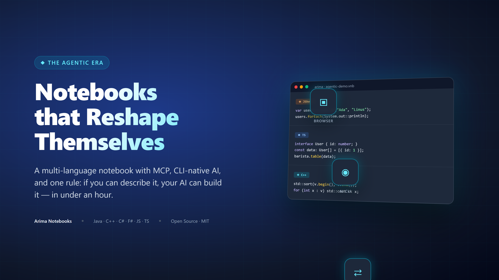
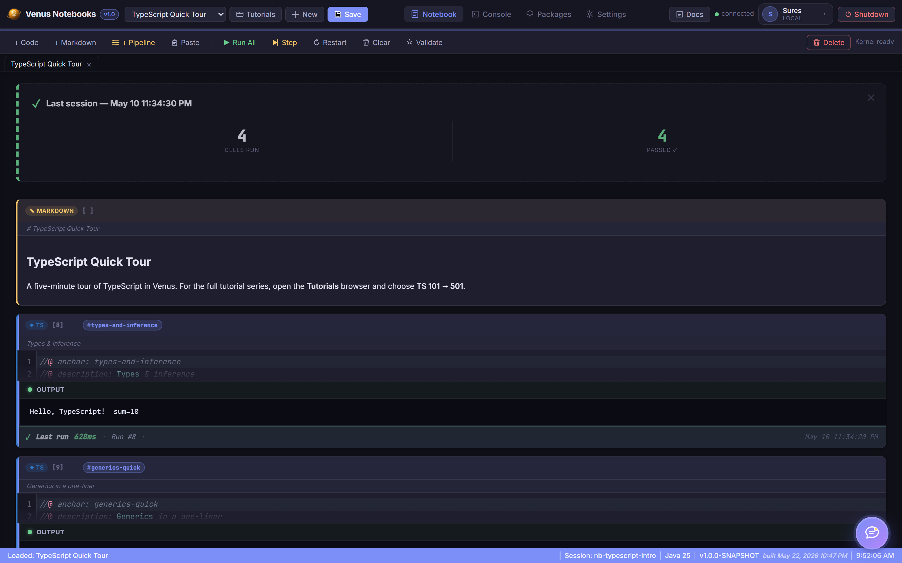
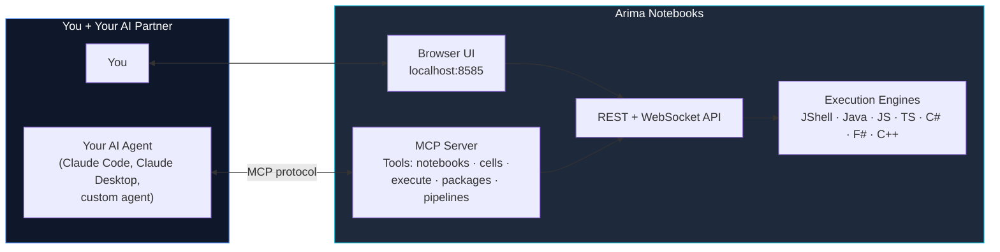

# Notebooks for the Agentic Era: Why I Built Arima to Be Reshaped, Not Just Used

### A multi-language, browser-based notebook with MCP, CLI-native AI, and a single rule: if you can describe what you want, your AI should be able to build it into the product itself in under an hour.

*By Suresh Chande · ~10 min read · Tags: Notebooks, MCP, Agentic AI, Developer Tools, Open Source*

---



---

## A Quiet Tribute Before the Pitch

I have loved Jupyter for years. It taught a whole generation of engineers and scientists how to think interactively. It made notebooks the lingua franca of data science. The ecosystem around it — kernels, widgets, JupyterHub, Colab — is one of the great open-source achievements of the last fifteen years.

This article isn't about replacing any of that.

It's about a simple observation: most of the tools we use every day — IDEs, notebooks, package managers, even our shells — were designed for a world where **the developer was the only intelligent agent in the room.** They optimized for *me typing into them*. They didn't optimize for *me, plus an AI, plus a CLI, plus an agent loop, all collaborating on the same artifact*.

That world is over. The agentic era needs tools designed for it. Not as replacements — as additions.

So I built one, called it **Arima Notebooks**, and open-sourced it. This is the story of *why* and the few decisions I'd want anyone building a modern developer tool to consider.

---


*The Arima UI: tabs across the top for Notebook · Console · Packages · Settings · Docs; cells with anchors and pipeline metadata; live status bar showing the active JShell session.*

---

## The Premise: Tools Built Before AI Were Built For a Different User

Walk through almost any tool you opened today and ask: *what was this designed around?*

- **Your IDE** was designed around a human reading and writing one file at a time
- **Your terminal** was designed around a human typing one command at a time
- **Your notebook** was designed around a human running one cell at a time
- **Your package manager** was designed around a human deciding what to install

These are good designs — for that user. But that user has a new partner now: an AI that can read the whole file, run a sequence of commands, run every cell, and decide what to install — all in the same loop, on the same artifact, in real time.

If a tool wasn't designed with that collaborator in mind, two things tend to be true:

1. The AI sits *outside* the tool, in a separate panel, copy-pasting code in and out
2. Customizing the tool itself still requires the old workflow — fork, learn the codebase, write code by hand, submit PR, wait

Arima is an experiment in flipping both. The AI sits *inside* the tool, and the tool itself is designed to be reshaped by an AI, by you, in under an hour.

---

## What Arima Actually Is

A locally-hosted, browser-based notebook. One command to start, one URL to open. Seven languages run side by side in the same notebook:

- **Java (JShell)** — official JDK REPL, state shared across cells
- **Java (full)** — per-cell `javac` compile + run
- **JavaScript** — Node.js subprocess
- **TypeScript** — Node 22.6+ type-stripping, optional `tsc --noEmit`
- **C#** — `dotnet run` with NuGet
- **F#** — `dotnet fsi` with inline `#r "nuget:"` directives
- **C++** — MSVC / GCC / Clang auto-detected

Maven, npm, and NuGet are first-class. Notebooks are JSON files on disk. Nothing is sent to a cloud — ever. None of that is the interesting part.

The interesting part is the three design decisions below.

---

## Decision 1 — AI Lives Inside the Notebook, Through Your Own CLI

Most "AI in the editor" experiences ask you for an API key and route through a vendor backend. That introduces a second relationship to manage, a second bill to pay, and a second data-flow path your security team has to bless.

Arima takes a different route. It shells out to whatever AI CLI you already have authenticated on your machine:

- **Claude Code CLI**
- **GitHub Copilot CLI**
- **Gemini CLI**

Switch providers in Settings. The AI runs as a local subprocess, using your existing CLI auth. No second API key. No second vendor. No exfiltration path that wasn't already there.



*A TypeScript notebook running in Arima — anchored cells, live output streaming, and the same look-and-feel whether the cell runs as Java, TypeScript, or C++.*

This is a small architectural choice with a large practical consequence. It means **the AI in Arima has the same powers as the AI in your terminal** — and we lean into that hard in Decision 3.

---

## Decision 2 — Arima Is an MCP Server. The Whole Thing.

This is the one I'm most excited about.

[MCP](https://modelcontextprotocol.io) — Model Context Protocol — is the standard that lets agents talk to tools in a structured way. Arima doesn't just *consume* MCP; it *publishes* itself as one.

That means: every notebook, every cell, every execution engine, every package install, every pipeline — is exposed as MCP tools. So you can:

- Open Arima in your browser and work in it directly, **or**
- Stay in Claude Code / Claude Desktop / any MCP-aware agent and drive Arima from there
- Or do both, on the same notebook, at the same time



This unlocks something specific: **the agent can prepare a notebook for you while you sleep.** You tell Claude Code "build me an exploration notebook for the new pricing API, with cells that load sample requests, validate the schema, and chart latency distributions" — and when you sit down in the morning, the notebook exists in Arima, every cell already populated, ready to run.

Conversely, **you can sit in the Arima UI and pull the agent's context** — "AI, here's the cell I'm staring at, why is the latency spike here?" — and it answers using the same provider, the same auth, the same context window.

The notebook becomes the shared artifact. You and the AI are both first-class users of it.

---

## Decision 3 — The Tool Is Designed to Be Reshaped

This is the philosophical core.

Most products say: *here is what we built; submit a feature request and we'll consider it.*

Arima says: *here is what we built; if you need something else, ask your AI to add it, and it should take less than an hour.*

This isn't a slogan. It's the result of specific choices:

- **No build step on the frontend.** Plain HTML/CSS/vanilla JS. Edit a file, refresh the browser, see the change. Your AI doesn't need to know Webpack, Vite, or React.
- **Plain Java backend, no Lombok, no magic.** Standard Spring Boot. Any agent that can read Java can extend it.
- **Subprocess-per-language.** Adding a new language means writing one `*ExecutionService.java` file modeled on the existing six.
- **Tiny conventions, not frameworks.** Notebook format is JSON. Cell metadata uses `//@` annotations. The MCP surface mirrors the REST surface 1:1.

The result: if you want a new chart type, a new language, a new export format, a custom keybinding, a different theme — you open a Claude Code session in the arima repo, describe what you want, and it ships.

And then the part that closes the loop:

> *"That worked. Package this as a PR back to the upstream repo."*

The same CLI that built your local change can prepare the contribution. The bar to giving back drops to the same level as the bar to customizing.


---

## Interoperability Over Tribalism

A question I get asked: *"So should I use Arima or Jupyter?"*

Wrong question. The right question is: *"What's the friction cost of moving between them?"*

I'd like that cost to be zero. There's no good reason a notebook authored in Arima shouldn't open in Jupyter, or vice versa. The artifact is JSON. The cells are code. The execution model differs, but the *content* is portable.

**To be clear: this isn't shipped yet.** Arima today reads and writes its own `.vnb` format — `.ipynb` round-tripping is coming in the next update, and it's a great first contribution for anyone who wants to dip in. The point isn't that any one notebook tool should "win." The point is that the developer should be free to pick whichever tool fits the moment, and move their work between them without ceremony — and we should be building toward that, not away from it.

The same applies to AI providers. Same applies to languages. Same applies to package ecosystems. **The era of "pick your tool and live inside it forever" is over.** The era of "compose what you need, swap when you want, shape what doesn't fit" is here.

---

## What This Looks Like In Practice

A normal afternoon with Arima, for me, looks like this:

1. Open a notebook from yesterday. Half the cells are JShell, two are TypeScript (for some npm package I wanted to try), one is C++ (for a perf comparison).
2. Realize I want a chart type Arima doesn't have. Open Claude Code in the repo. *"Add a violin plot helper to the JavaScript helpers module."* Eighteen minutes later, it works.
3. Use the new helper in the notebook.
4. Ask Claude (in the AI panel inside Arima, attached to the cell) why my numbers look off. It explains. I fix.
5. *"Package this morning's helper change as a PR with a good description."* Done.
6. Close the laptop.

None of those steps required leaving the notebook abstraction. None of them required learning a new framework. None of them required filing a feature request with someone else and waiting.

That's what I think a modern developer tool should feel like.

---

## Try It

```bash
git clone https://github.com/snchande/Venus.git
cd Arima
./arima       # Windows CMD
./arima.ps1   # PowerShell
./arima.sh    # macOS / Linux
```

The CLI builds the JAR, starts the server on port 8585, and opens your browser. About 30 seconds.

If you want to drive it from an agent instead, add the MCP server config to Claude Code or Claude Desktop — see the repo's `docs/MCP.md`.


*Two surfaces, one artifact: Claude Desktop on the left calling `barista.create_notebook`, `barista.add_cell`, `barista.execute_cell` over MCP — Arima on the right showing the resulting notebook ready to inspect.*

---

## An Invitation

I built Arima because I wanted a notebook that fit the way I — and my AI — actually work together now. I open-sourced it because I'm sure other people will want different things, and the most exciting outcome is *not* that Arima stays the way I built it.

The most exciting outcome is that someone clones it tonight, asks their AI to add a feature I never imagined, ships that feature in 40 minutes, and pushes the PR back upstream — and a week later someone else benefits.

That loop — *use, reshape, contribute, repeat* — is what I think open source should feel like in 2026. Tools that bend toward the person using them, not the other way around.

Jupyter taught us to think in cells. Arima is one attempt to extend that thinking into the agentic era. If it sparks even one better idea in someone else's hands, it'll have been worth the weekends.

---

### Links

- **GitHub:** [github.com/snchande/Venus](https://github.com/snchande/Venus)
- **MCP setup:** `docs/MCP.md` in the repo
- **Tutorials:** 28 built-in across all 7 languages
- **License:** MIT

If this resonates, a 👏 helps it reach others thinking about the same questions. And if you ship a fork or a contribution, I'd love to see it.

---

*Built with Spring Boot, JShell, MCP, and the conviction that the tools of the next decade will be the ones that let their users reshape them.*
